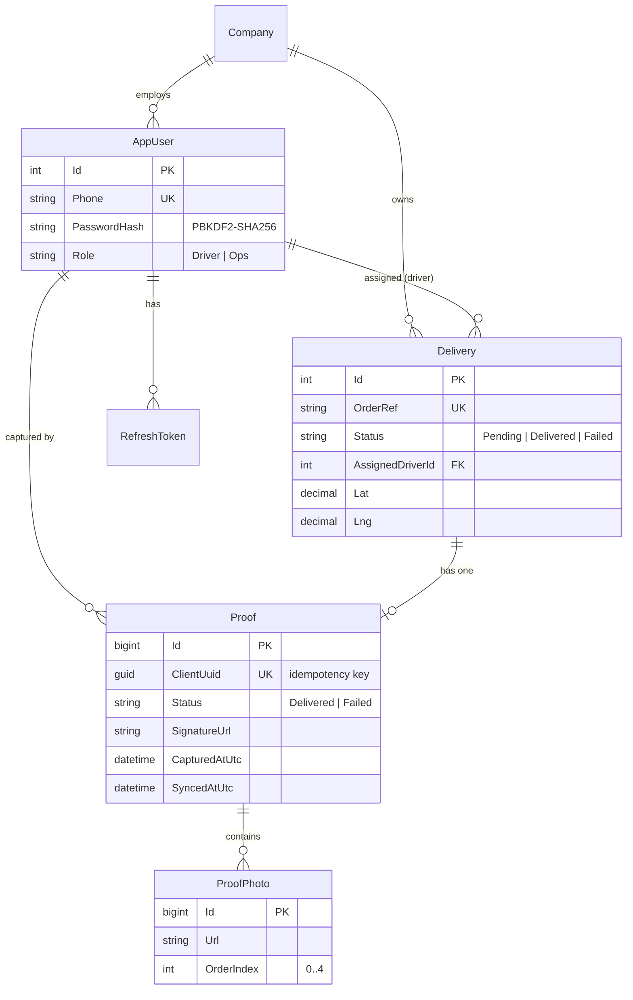
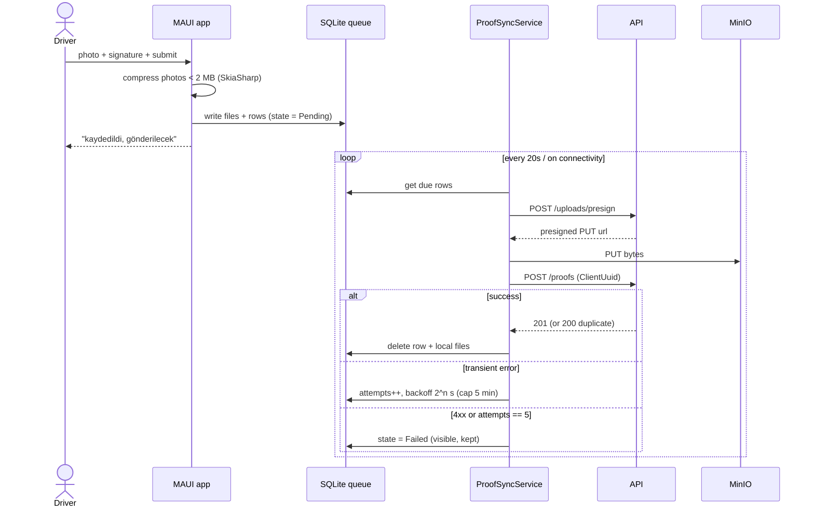

# Architecture notes

## Data model

## Proof capture — offline path

## Why these choices

- **Stored procedures for every write** — the job posting calls for T-SQL + Dapper + SP experience, and it
  keeps transactional logic (idempotency, one-proof-per-delivery, driver ownership) in one place.
- **Two hosts (Api + Web)** — both the panel and the mobile app consume the same REST API; the API is the
  single source of truth and the only thing that touches the database.
- **Presigned URLs** — large photo uploads bypass the API process entirely.
- **`ClientUuid` idempotency** — the offline queue may POST the same proof more than once (retry after a
  dropped response); the API dedupes so exactly one record is ever created.
- **Versioned migrations (`020_` then `021_`)** — changes ship as new numbered scripts, not edits to shipped
  ones, mirroring real deployment discipline.
